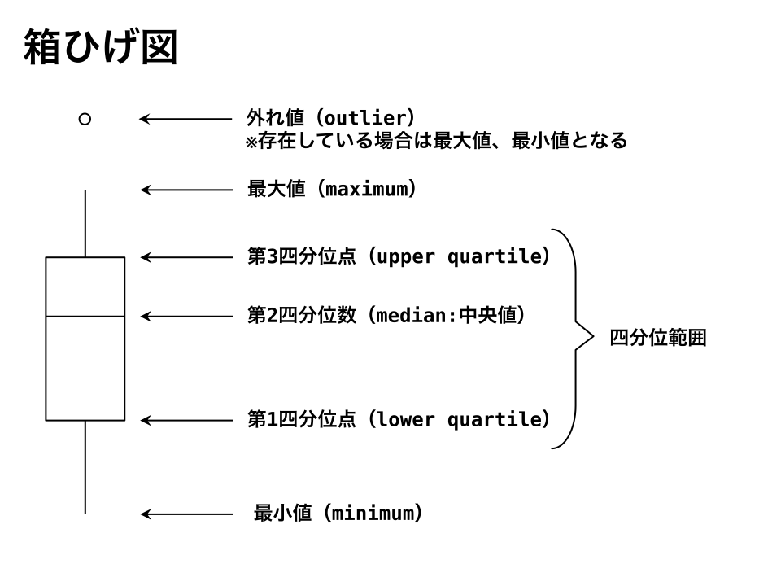

# 箱ひげ図

## 分位点の考え方

観測値を値の小さい順で並び替えて、小さい方からx%点にある値を

- x%パーセンタイル（percentile）
- x%分位点

などと言います。

## 四分位点（quartile）

データを小さい順で並べ替えたときに4等分し、その結果できた3つの分割点を指しています。

|用語|説明|
|:-:|:-:|
|最小値（minimum）|値が小さくなる方向のひげの先端|
|第1四分位点（lower quartile） $Q_1$|25%分位点|
|第2四分位点（median） $Q_2$|50%分位点|
|第3四分位点（upper quartile）$Q_3$|75%分位点|
|最大値（maximum）|値が大きくなる方向のひげの先端|
|四分位範囲|データの真ん中の50%部分の長さ|

## 参考文献

- 東京大学教養学部統計学教室『統計学入門 (基礎統計学Ⅰ) (日本語) 単行本 – 1991/7/9』
