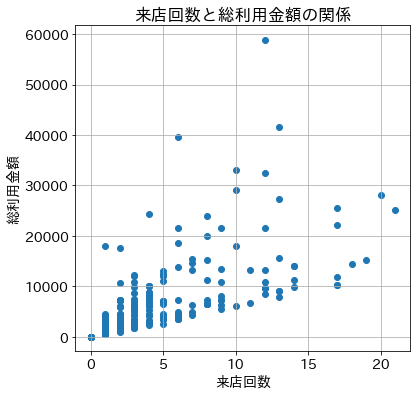
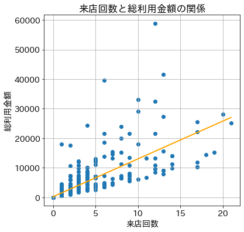

# 1億人のための統計解析をpythonで - case1_part2

- [1億人のための統計解析をpythonで - case1_part2](#1億人のための統計解析をpythonで---case1_part2)
  - [解析案件整理](#解析案件整理)
    - [（part1から再掲）解析要件定義](#part1から再掲解析要件定義)
    - [解析前の準備](#解析前の準備)
  - [Analysis 2: 総利用金額は来店回数の多寡によって影響を受けるかどうか](#analysis-2-総利用金額は来店回数の多寡によって影響を受けるかどうか)
    - [散布図を使って来店回数と総利用金額の関係を可視化する](#散布図を使って来店回数と総利用金額の関係を可視化する)
    - [最小二乗法による単回帰分析で関係をモデル化してみる](#最小二乗法による単回帰分析で関係をモデル化してみる)
      - [結果の読み取り](#結果の読み取り)
    - [t値の算出方法に関して](#t値の算出方法に関して)
      - [t値の計算過程の確認](#t値の計算過程の確認)
  - [参考文献](#参考文献)

詳しい内容は書籍「西内啓『1億人のための統計解析』」をご参照ください。

## 解析案件整理

### （part1から再掲）解析要件定義

| 要件 | 定義 |
| :-: | :-: |
| アウトカム | 過去3か月間における夜間帯の総利用金額 |
| 解析単位 | 顧客 |
| 説明変数 | アウトカム以外のすべての項目 |

### 解析前の準備

データを読み込み総利用金額の列を追加します。

**CODE**

```python
import scipy
import pandas as pd
import numpy as np
import statsmodels.api as sm
import matplotlib.pyplot as plt

# matplotlib日本語文字化け対策
# plt.rcParams['font.family'] = 'sans-serif'
# plt.rcParams['font.sans-serif'] = ['Hiragino Maru Gothic Pro', 'Yu Gothic', 'Meirio', 'Takao', 'IPAexGothic', 'IPAPGothic', 'VL PGothic', 'Noto Sans CJK JP']

# matplotlib日本語文字化け対策（colaboratory向け）
# !pip install japanize-matplotlib
# import japanize_matplotlib

plt.rcParams['font.size'] = 14
```

**CODE**

```python
# ファイル読み込み
df = pd.read_excel('[ファイル設置パス]/case1.xlsx')

df['総利用金額'] = df['来店回数'] * df['利用金額']
```

## Analysis 2: 総利用金額は来店回数の多寡によって影響を受けるかどうか

### 散布図を使って来店回数と総利用金額の関係を可視化する

**CODE**

```python
# 来店回数と総利用金額の関係を散布図に表す
X = df['来店回数']
y = df['総利用金額']

fig, ax = plt.subplots(figsize=(6,6))
ax.scatter(X,y)
ax.set_title(f"来店回数と総利用金額の関係")
ax.set_ylabel('総利用金額')
ax.set_xlabel('来店回数')
ax.grid(True)
```

**OUTPUT**




なんとなく横軸の来店回数が増えると縦軸の総合利用金額も増える関係でありそうなことが散布図から見えてくる。


### 最小二乗法による単回帰分析で関係をモデル化してみる

前項でなんとなくある関係が見えてきそうと述べましたが、このなんとなくを統計的に解明する方法があり、今回の事柄でいうと最小二乗法による単回帰分析という手法で明らかにしていきます。

**CODE**

```python
# 説明変数を設定
X = df['来店回数']
# 目的変数を設定
y = df['総利用金額']

# 最小二乗法の実施
results = sm.OLS(y, sm.add_constant(X)).fit()

# 結果の概要を表示
print(results.summary())

# 回帰直線を描画するために予測値を取得しておく
y_pred = results.predict(sm.add_constant(X))

fig, ax = plt.subplots(figsize=(6,6))
ax.scatter(X, y)
ax.plot(X, y_pred, color='orange')
ax.set_title(f"来店回数と総利用金額の関係")
ax.set_ylabel('総利用金額')
ax.set_xlabel('来店回数')
ax.grid(True)
```

**OUTPUT**

```
                            OLS Regression Results                            
==============================================================================
Dep. Variable:                  総利用金額   R-squared:                       0.612
Model:                            OLS   Adj. R-squared:                  0.612
Method:                 Least Squares   F-statistic:                     1577.
Date:                Mon, 21 Dec 2020   Prob (F-statistic):          1.27e-207
Time:                        20:56:41   Log-Likelihood:                -9423.8
No. Observations:                1000   AIC:                         1.885e+04
Df Residuals:                     998   BIC:                         1.886e+04
Df Model:                           1                                         
Covariance Type:            nonrobust                                         
==============================================================================
                 coef    std err          t      P>|t|      [0.025      0.975]
------------------------------------------------------------------------------
const        191.6544    103.313      1.855      0.064     -11.081     394.390
来店回数        1277.7612     32.177     39.710      0.000    1214.619    1340.904
==============================================================================
Omnibus:                     1216.995   Durbin-Watson:                   2.032
Prob(Omnibus):                  0.000   Jarque-Bera (JB):           198570.410
Skew:                           6.032   Prob(JB):                         0.00
Kurtosis:                      70.972   Cond. No.                         3.56
==============================================================================

Warnings:
[1] Standard Errors assume that the covariance matrix of the errors is correctly specified.
```





#### 結果の読み取り

出力結果

|項目|coef|std err|t|P>\|t\||[0.025|0.975]
|:-:|:-:|:-:|:-:|:-:|:-:|:-:|
|const|191.6544|103.313|1.855|0.064|-11.081|394.390|
|来店回数|1277.7612|32.177|39.710|0.000|1214.619|1340.904|

説明変数に関する情報をまとめると上記となります。さて、単回帰分析とはデータを下記のような線形のモデルに当てはめて、解析していく手法となりますが、

$$
y_i = \beta_0 + \beta_1x_i + \epsilon_i \quad (i=1,2,...,n)
$$

このモデルは説明変数が1つの単回帰分析のモデルとなっており、 $\beta_0$ は切片、 $\beta_1$ は傾きを表しています。また、 $\epsilon_i$ は誤差を示しております。出力結果の『coef』という列にこの情報があります。これらを解釈すると、目的変数である総利用金額は $191.6544$ を基準として、来店回数が $1$ 増えるごとに総利用金額は $1277.7612$ 増えるという読み取りになります。


では来店回数が10回目の人の総利用金額はいくらになると予測できますでしょうか？これは、回帰式を用いて

$$
191.6544 + 1,277.7612 \times 10 + \epsilon_i = 12,969.2664 + \epsilon_i
$$

と予測できます。

それではこの予測式がどの程度信頼できるかというとこれはP値という結果から読み取ることができ、来店回数の結果に関してはP値が $0.000$ つまり $<0.001$ となっており、ばらつきのあるデータからこの回帰係数が算出される確率は0.1%未満で、1000回に1度たまたま算出される可能性があるという稀な結果となっています。つまり偶然算出されるような値ではなく、このような傾向を潜在的に持っているデータから必然的に算出された値と捉えれば良いです。他方、このp値が10%であるとすると10回に1回はデータのばらつき方の偶然によって算出される可能性があるということを示しています。

ここから先は書籍を参考にしていただきたいですが、『来店回数が増えれば総利用金額が上がっていく示唆が得られた！！』と声を大にして誰かに言えるでしょうか？『それ、当たり前だよね？』と返事をいただくことになると思っております。当たり前の結果を確認することはあるかもしれませんが、報告するかどうか、どう活用するかは冷静な見極めが必要だと思います。労力がかかったデータ抽出作業ほどやりがちだと思います笑。自戒も込めて。


### t値の算出方法に関して

t値はどのように算出された値なのかを、pythonを使って計算過程を示しながら述べていきたいと思います。

<div>

$$
y_i = \beta_0 + \beta_1x_i + \epsilon_i \quad (i=1,2,...,n)
$$

このモデルは説明変数が1つの単回帰分析のモデルとなっており、 $\beta_0$ は切片、 $\beta_1$ は傾きを表しています。

ここで $C_1 = \dfrac{ 1 }{ \sum_{i=1}^n (x_i - \bar{x})^2 }$ とおくと、最小2乗推定量 $\hat \beta_1$ が誤差項が互いに独立で同一の正規分布に従っていれば、 $\beta_1$ の標本分布は $N(\beta_1, \sigma^2C_1)$ であり基準化すると以下が得られます。

$$
Z = \dfrac{ \hat \beta_1 - \beta_1 }{ \sqrt{\sigma^2C_1} } \sim N(0,1)
$$

一方、 $Y = (n-2)\hat \sigma^2 / \sigma^2$ は自由度 $n-2$ のカイ2乗分布に従い $\hat \beta_1$ とは独立です。

したがって

$$\dfrac{ Z }{ \sqrt{Y / n-2} }$$

は『標準正規分布に従う確率変数、割ることのルートのカイ2乗分布従う確率変数 / 自由度』という関係になっているので、t分布の定義より、自由度 $n-2$ のt分布に従う統計量となります。

すなわち

$$\begin{aligned}
~& \dfrac{
    (\hat \beta_1 - \beta_1) / \sqrt{\sigma^2 C_1}
}{
    \sqrt{ \dfrac{(n-2)\hat \sigma^2 / \sigma^2}{n-2} }
}
\\
=& \dfrac{
    (\hat \beta_1 - \beta_1) / \sqrt{\sigma^2 C_1}
}{
    \sqrt{ \hat \sigma^2 / \sigma^2}
}
\\
=& \dfrac{
    (\hat \beta_1 - \beta_1)
}{
    \sqrt{\sigma^2 C_1}
}
\dfrac{
    \sqrt{\sigma^2}
}{
    \sqrt{ \hat \sigma^2 }
}
\\
=& \dfrac{
    \hat \beta_1 - \beta_1
}{
    \sqrt{\hat \sigma^2 C_1}
} \sim t(n-2)
\end{aligned}$$

そこで

$$
H_0 : \beta_1 = 0 \quad H_1 : \beta_1 \neq 0
$$

に対する検定統計量

$$
\dfrac{
    \hat \beta_1
}{
    \sqrt{\hat \sigma^2 C_1}
}
$$

は帰無仮説 $H_0$ が正しいとき自由度 $n-2$ のt分布に従います。これを利用することでt検定が可能であり、このt検定の統計量の実現値がt値としてstatsmodelsの最小2乗法の実施結果に表示されています。

</div>

#### t値の計算過程の確認

出力結果の再確認

|項目|coef|std err|t|P>\|t\||[0.025|0.975]
|:-:|:-:|:-:|:-:|:-:|:-:|:-:|
|来店回数|1277.7612|32.177|39.710|0.000|1214.619|1340.904|


<div>

この出力結果は

$\beta_1 = 1277.7612$ を表しております。

標準誤差は $32.177$ 、t値は $39.710$ 、p値は $<0.001$ といった具合です。先ほどの数式を使って確認してみましょう。

$$
H_0 : \beta_1 = 0 \quad H_1 : \beta_1 \neq 0
$$

に対する検定統計量は

$$
C_1 = \dfrac{ 1 }{ \sum_{i=1}^n (x_i - \bar{x})^2 }
$$

とおくと

$$
\dfrac{
    \hat \beta_1
}{
    \sqrt{\hat \sigma^2 C_1}
}
$$

となります。

</div>

**CODE**

```python
# t値の算出
df_1 = pd.DataFrame([y_pred, y, X]).T

# 係数
beta_1 = 1277.7612

# 残差平方
df_1['squared_residual'] = (df_1['総利用金額'] - df_1['prediction']) **2

# 偏差平方
df_1['squared_deviation'] = (df_1['来店回数'] - df_1['来店回数'].mean()) **2

# 残差平方和
RSS = df_1['squared_residual'].sum()
DOF = (len(df_1) - 2)

# 分散の推定値
estimate_of_variance = RSS / DOF

# 偏差平方和
C_1 = df_1['squared_deviation'].sum()

# t値
print(f't値: { beta_1 / np.sqrt(estimate_of_variance / C_1) }')
print(f't値: {results.tvalues["来店回数"]} (statsmodels)')
```

**OUTPUT**

```
t値: 39.710265150538596
t値: 39.71026636722764 (statsmodels)
```

算出できました！

多少ずれておりますが（たぶん $\beta_1$ を丸めない値で算出すれば近づくかな？）、問題ない精度だと考えています。


## 参考文献
- 西内啓『1億人のための統計解析』
- 西内啓『統計学が最強の学問である[実践編]』
- 倉田 博史(著), 星野 崇宏(著)『入門統計解析』